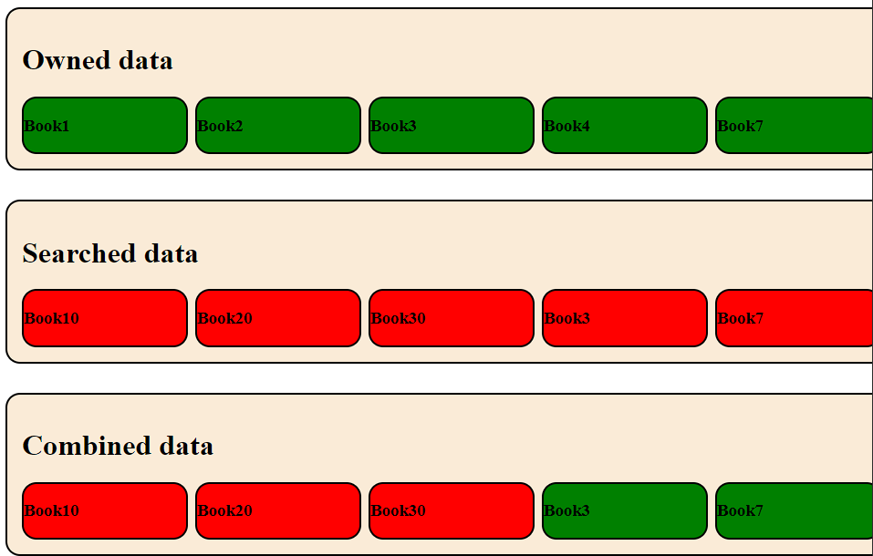

# ARRAY COMBINE EXERCISE

## This is an exercise to check 2 Arrays against each and filter or change specifict date.

<br>

# How to install

## after cloning this Repo, install it with

```
npm install
```

## and start it with

```
npm run start
```

## head inside your Browser to http://localhost:3000

# Usage

## This Repo has two branches. You do the exercise on the **_"main"_** branch and on the **_"solution"_** branch you find a possible answer.

<br>

### **_"Combined data"_** should contain all "Books" from **_"Searched data"_**.

<br>

### If **_"Searched data"_** and **_"Owned data"_** have a "Book" in common, it should be green in **_"Combined data"_**, else stay red

# Desired result


